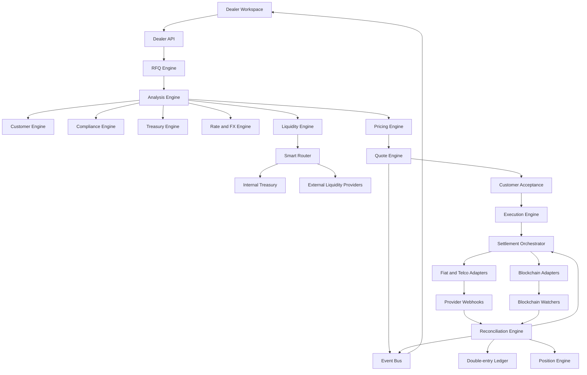

# Dealer Workspace Live Architecture and Workflow Guide

## 1. Purpose

The Dealer Workspace is an institutional dealing workflow. It is not only a dashboard or calculator. The dealer submits an RFQ, the platform evaluates whether it can be serviced, produces a firm quote, accepts the customer decision, executes the trade, settles each obligation, and reconciles the result.

The frontend displays workflow state. Backend engines own decisions, pricing, reservations, provider calls, ledger entries, and final settlement status.

## 2. Target Architecture



## 3. Trust Boundaries

### Frontend

The Dealer Workspace may:

- collect RFQ inputs
- display analysis results
- display prices and routes
- allow a dealer spread override
- request quote generation
- request quote sending
- display live settlement events

The frontend must not:

- decide whether a trade is eligible
- calculate the authoritative customer price
- decide whether a quote is expired
- mark a settlement complete
- credit balances
- fabricate provider confirmations

### Backend

The backend must own:

- state transitions
- authorization
- quote calculation
- expiry validation
- limits and compliance decisions
- liquidity reservations
- provider requests
- blockchain confirmations
- ledger posting
- reconciliation

### Providers and chains

Provider APIs and blockchains are external sources of truth for their respective obligations. An accepted HTTP request is not proof of settlement. Final status requires a provider callback, a verified provider status query, or a confirmed blockchain transaction.

## 4. Workflow State Machines

### RFQ state

```text
DRAFT
  -> ANALYZING
  -> QUOTE_READY
  -> QUOTED
  -> ACCEPTED
  -> EXECUTING
  -> SETTLING
  -> COMPLETED
```

Failure and exit states:

```text
BLOCKED
EXPIRED
REJECTED
CANCELLED
FAILED
MANUAL_REVIEW
```

### Quote state

```text
DRAFT
  -> SENT
  -> ACCEPTED
  -> EXECUTING
  -> EXPIRED
  -> REJECTED
  -> CANCELLED
```

A sent quote is immutable. A changed price creates a new quote version; it must not overwrite the old quote.

### Settlement state

```text
PENDING_SETTLEMENT
  -> INITIATED
  -> PARTIALLY_SETTLED
  -> COMPLETED
```

Failure states:

```text
FAILED
TIMEOUT
REFUND_PENDING
REFUNDED
MANUAL_REVIEW
```

### Settlement leg state

Each leg has independent state:

```text
PENDING
  -> INITIATED
  -> SUBMITTED
  -> CONFIRMING
  -> CONFIRMED
```

A settlement is complete only when every required leg is confirmed and reconciliation succeeds.

## 5. End-to-End Workflow

## Step 1: Dealer creates an RFQ

The dealer enters:

- customer
- direction
- source asset
- destination asset
- amount
- settlement channel
- destination phone or wallet
- network

The API creates an RFQ with an immutable creation event.

```http
POST /api/admin/dealer/rfqs
```

Initial processing:

```text
API validates input
  -> RFQ Engine creates RFQ
  -> status = ANALYZING
  -> Analysis Engine runs checks
  -> result is stored
  -> status = QUOTE_READY or BLOCKED
```

The RFQ response should include a complete analysis object, not only a boolean.

## Step 2: Analysis Engine runs checks

Checks should run in parallel where possible.

### Customer checks

- account exists
- account is active
- KYC/KYB is approved
- customer tier is known
- country is allowed
- asset is permitted
- requested amount is within single-transaction limit
- daily limit is available
- current volume is known
- remaining exposure is sufficient

### Treasury checks

- treasury balance is available
- reserved balance is excluded
- pending balance is excluded
- required amount is calculated in the correct asset
- minimum balance is protected
- wallet or bank source is available
- internal inventory is sufficient or marked partial

The available-balance formula is:

```text
available = total - reserved - pending
```

### Compliance checks

- customer screening
- sanctions screening
- wallet screening
- country restrictions
- transaction purpose
- asset restrictions
- velocity rules
- risk rating

### Rate and FX checks

- rate book is active
- rate source is known
- rate is not stale
- pair is supported
- conversion path exists
- rate timestamp is recorded

### Risk checks

- customer exposure before and after
- treasury utilization before and after
- counterparty exposure
- liquidity concentration
- volatility
- network risk
- settlement risk

The result must identify failed checks and their reasons.

```json
{
  "passed": true,
  "checks": {
    "customer": [],
    "treasury": [],
    "compliance": [],
    "risk": []
  },
  "liquidity": {},
  "costs": {},
  "risk": {}
}
```

## Step 3: Liquidity Engine selects a route

The Liquidity Engine asks each eligible source for executable liquidity.

Possible sources:

- internal treasury wallet
- treasury bank account
- LP A
- LP B
- LP C
- exchange account
- payment provider float

Each source must return:

- available amount
- price
- fee
- quote timestamp
- expiry
- settlement method
- provider quote ID
- provider status

The Smart Router then selects the cheapest executable route subject to risk and operational constraints.

Example route:

```text
Internal Treasury: 60%
LP A:              26%
LP B:              14%
```

The route must be persisted so the dealer can later see why a price was selected.

## Step 4: Pricing Engine calculates the quote

The Pricing Engine combines:

```text
reference market price
+ FX conversion cost
+ funding cost
+ liquidity provider cost
+ network cost
+ counterparty risk premium
+ treasury inventory premium
+ dealer margin
= customer price
```

For a KES to USDA BUY example:

```text
market rate = 130.50 KES/USDA
spread = 50 bps
customer rate = 130.50 * (1 + 50 / 10000)
customer rate = 131.155 KES/USDA
receive amount = 50,000 / 131.155
```

The side of the trade must be handled explicitly. Do not assume that multiplying the input amount by the rate is correct for every pair and direction.

## Step 5: Dealer override

The dealer may change the margin within policy limits.

The backend must enforce:

- minimum spread
- maximum spread
- minimum absolute margin
- customer-specific pricing rules
- approval requirements for exceptional pricing

An override below the permitted margin should return a blocked decision or require approval. The UI is not the enforcement layer.

## Step 6: Quote is sent

The dealer sends the quote after reviewing the calculated price.

```http
POST /api/admin/dealer/rfqs/{rfq_id}/quote
```

The backend should:

1. re-check the RFQ is quote-ready
2. re-check the rate is current
3. re-check liquidity is still executable
4. validate the dealer override
5. create a new quote version
6. store the exact price and route
7. set `expiresAt`
8. publish `QUOTE_SENT`
9. notify the customer

Example quote:

```json
{
  "quoteId": "QT-20260825-001",
  "rfqId": "RFQ-20260825-001",
  "version": 1,
  "marketRate": 130.50,
  "customerRate": 131.155,
  "requestedAmount": 50000,
  "receiveAmount": 381.26,
  "spreadBps": 50,
  "route": [],
  "status": "SENT",
  "expiresAt": "2026-08-25T12:00:60Z"
}
```

The frontend countdown is only a display. The backend must reject acceptance after expiry.

## Step 7: Customer accepts

Acceptance should be an authenticated customer action.

```http
POST /api/customer/quotes/{quote_id}/accept
```

The backend must atomically:

1. verify quote status is `SENT`
2. verify quote has not expired
3. re-run liquidity and compliance checks
4. reserve required liquidity
5. create the execution record
6. set quote to `ACCEPTED`
7. publish `QUOTE_ACCEPTED`

If any check fails, the quote remains unexecuted and moves to `REJECTED` or `MANUAL_REVIEW`.

## Step 8: Execution

The Execution Engine receives only an accepted, valid quote.

```http
POST /api/admin/dealer/rfqs/{rfq_id}/execute
```

It must not accept a stale or unaccepted quote.

Execution creates:

- execution record
- settlement record
- settlement legs
- liquidity reservation
- workflow events

The API returns quickly. Long provider operations run in a durable worker, not only an in-memory background task.

## Step 9: Settlement legs run independently

For a BANK_TO_WALLET transaction:

```text
Fiat leg:
Customer bank/mobile money -> Jasiri collection account

Digital leg:
Jasiri treasury wallet -> Customer wallet
```

The two legs may progress at different times. A confirmed fiat leg does not imply a confirmed blockchain leg.

Each provider adapter should support:

```text
initiate()
get_status()
verify_callback()
refund_or_compensate()
```

## Step 10: Provider callbacks and blockchain confirmation

### Fiat and telco

The provider returns an immediate processing response, followed later by a callback. The immediate response means only that the request was accepted for processing.

The callback handler must:

- verify the callback signature where supported
- store the raw event
- deduplicate repeated callbacks
- match the provider reference
- update the correct settlement leg
- publish a status event

### Blockchain

The blockchain adapter must:

- validate destination address
- estimate fees
- submit the transaction
- store transaction hash
- poll or consume indexer events
- require confirmation depth
- detect failed transactions and reorgs
- update the digital leg only after verification

## Step 11: Reconciliation

The Reconciliation Engine compares:

- quote
- execution
- settlement
- provider callback
- blockchain transaction
- ledger entries
- treasury positions

Completion rule:

```text
all required provider legs confirmed
AND blockchain transfer confirmed
AND ledger entries posted
AND balance changes match
AND no unresolved exception
= settlement COMPLETED
```

A UI timer or elapsed time must never mark a real settlement complete.

## Step 12: Ledger and position updates

Use double-entry accounting rather than directly changing balances without an accounting record.

Example KES to USDA trade:

```text
Customer account:
  -50,000 KES
  +381.26 USDA

Treasury account:
  +50,000 KES
  -381.26 USDA

Revenue account:
  +gross margin
  -funding cost
  -network cost
```

The Position Engine updates:

- total balance
- reserved balance
- pending balance
- available balance
- minimum-threshold alerts

## 6. Engine Ownership Table

| Engine | Owns |
|---|---|
| RFQ Engine | RFQ creation, status, audit trail |
| Customer Engine | customer profile, limits, tier, eligibility |
| Compliance Engine | KYC, AML, sanctions, wallet and policy checks |
| Rate/FX Engine | reference prices, conversions, freshness |
| Treasury Engine | balances, reservations, available inventory |
| Liquidity Engine | provider quotes and source availability |
| Smart Router | route selection and split allocation |
| Pricing Engine | customer rate, spread, costs, P&L |
| Quote Engine | versions, expiry, send, accept, reject |
| Execution Engine | accepted quote execution and reservation |
| Settlement Engine | settlement lifecycle and leg coordination |
| Provider Adapter Engine | Airtel, M-Pesa, bank, exchange calls |
| Blockchain Engine | transaction submission and confirmation |
| Ledger Engine | double-entry financial records |
| Position Engine | treasury balances and thresholds |
| Reconciliation Engine | matching external and internal records |
| Notification Engine | WebSocket, callback, email and customer alerts |
| Audit Engine | immutable activity history |

## 7. Real-Time Event Contract

Every meaningful state change should create an event.

```text
RFQ_CREATED
ANALYSIS_STARTED
ANALYSIS_COMPLETED
RFQ_BLOCKED
RFQ_QUOTE_READY
QUOTE_DRAFTED
QUOTE_SENT
QUOTE_EXPIRED
QUOTE_ACCEPTED
LIQUIDITY_RESERVED
EXECUTION_STARTED
SETTLEMENT_CREATED
FIAT_INITIATED
FIAT_CONFIRMED
DIGITAL_TRANSFER_SUBMITTED
BLOCKCHAIN_CONFIRMED
LEDGER_POSTED
RECONCILIATION_MATCHED
SETTLEMENT_COMPLETED
SETTLEMENT_FAILED
MANUAL_REVIEW_REQUIRED
```

Event shape:

```json
{
  "eventId": "EVT-...",
  "type": "FIAT_CONFIRMED",
  "aggregateType": "settlement",
  "aggregateId": "SET-...",
  "occurredAt": "...",
  "payload": {},
  "idempotencyKey": "provider-reference-..."
}
```

The Dealer Workspace can subscribe through WebSocket or Server-Sent Events. Polling remains useful as a fallback and for recovery after reconnecting.

## 8. Persistence Model

The minimum production collections or tables are:

```text
rfqs
rfq_analysis_results
quote_versions
executions
settlements
settlement_legs
provider_events
blockchain_transactions
liquidity_reservations
ledger_transactions
ledger_entries
position_snapshots
workflow_events
notifications
audit_events
```

Important properties:

- external IDs are unique
- provider callbacks are idempotent
- quote versions are immutable
- financial entries are append-only
- state transitions are validated
- every mutation records actor and timestamp
- monetary values use Decimal or integer minor units where appropriate

## 9. Required Infrastructure

```text
FastAPI                  API and command handling
MongoDB or PostgreSQL    workflow and financial persistence
Redis                    locks, short-lived quote state, pub/sub
Durable worker           provider and blockchain jobs
WebSocket/SSE gateway    real-time UI updates
Provider webhooks        asynchronous payment results
Blockchain indexer       confirmed chain events
Secrets manager          provider credentials and wallet keys
Monitoring and alerts    failures, stale jobs, threshold breaches
```

A durable queue is important. An in-memory `asyncio` task can disappear when the process restarts and should not be the only settlement mechanism.

## 10. Airtime and Blockchain Boundary

Airtime is generally real off-chain telecom value. It is delivered by a telecom or payment provider to a phone number. It is not automatically a blockchain token.

A strategy such as:

```text
Airtime procurement
  -> internal valuation or ledger entry
  -> stablecoin conversion
  -> Celo/Cardano blockchain transfer
```

is hybrid:

- procurement and redemption are off-chain provider operations
- internal airtime valuation is an accounting representation
- stablecoin movement can be on-chain if a real contract transaction is submitted and confirmed

An internal `AIRT` asset code or `AIRTIME_KES` ledger entry does not prove that a token exists on-chain. On-chain tokenization requires a deployed token contract, mint/burn permissions, wallet custody, transaction hashes, and independent verification.

## 11. Current Code Versus Target

The current workspace already has useful foundations:

- Dealer Workspace screens
- RFQ and quote routes
- treasury rate book
- Airtel callback handling for general payment flows
- Cardano and Celo integration modules
- settlement UI polling
- RFQ regression test

The following areas still need to be replaced or completed for live operation:

- hardcoded customer checks
- synthetic inventory values
- synthetic liquidity-provider quotes
- fixed funding, FX, network and risk values
- elapsed-time settlement simulation
- placeholder `send_real_airtime()` in the swap engine
- mock blockchain response in the swap engine
- missing durable worker for dealer settlements
- missing authenticated customer acceptance endpoint
- missing provider-backed dealer settlement callbacks
- missing double-entry posting for the dealer workflow
- missing complete reconciliation record

## 12. Implementation Sequence

### Phase 1: Domain contracts

Create typed models and validated transitions for RFQ, analysis, quote, execution, settlement, leg, event, reservation and ledger records.

Deliverable:

```text
RFQ -> ANALYZING -> QUOTE_READY
```

### Phase 2: Real analysis

Implement Customer, Compliance, Treasury, Rate and Risk engines. Replace hardcoded analysis values with database and provider-backed reads.

Deliverable:

```text
Real customer and treasury data -> PASS or BLOCKED
```

### Phase 3: Real liquidity and pricing

Add a provider interface, source quote normalization, smart routing, cost aggregation, dealer margin policy and override approval rules.

Deliverable:

```text
Executable route -> immutable quote version
```

### Phase 4: Quote acceptance

Add customer authentication, expiry enforcement, quote revalidation, atomic liquidity reservation and event publication.

Deliverable:

```text
SENT -> ACCEPTED -> EXECUTING
```

### Phase 5: One real settlement corridor

Implement one corridor end to end before adding multiple providers. For example:

```text
KES -> USDA or USDC
```

Connect one fiat provider and one blockchain network with real callbacks and confirmation checks.

Deliverable:

```text
Accepted quote -> provider-backed settlement
```

### Phase 6: Ledger and reconciliation

Post double-entry records and reconcile provider, chain, wallet, bank and ledger states.

Deliverable:

```text
all obligations confirmed -> COMPLETED
```

### Phase 7: Real-time UI

Replace primary polling with event-driven updates, while retaining polling recovery. Show source, timestamp, status, provider reference and failure reason.

## 13. First Coding Slice

The safest first implementation slice is the domain contract and Analysis Engine, in this order:

1. Define RFQ and analysis models.
2. Add a transition validator.
3. Move analysis logic into an `AnalysisEngine` service.
4. Make customer eligibility database-backed.
5. Make treasury availability database-backed.
6. Persist analysis results and events.
7. Add blocked-case tests.
8. Connect the existing UI to the structured response.

Do not connect live money movement until this slice can reliably answer:

```text
Can this customer execute this exact trade, at this time, using this route?
```

Once that answer is authoritative, the Quote Engine and then one real Settlement Adapter can be added without building on simulated decisions.

## 14. Implementation Progress Tracker

This is the current implementation journey. The green stages are implemented in the workspace; yellow stages are partially implemented; gray stages are the next work.

```mermaid
flowchart LR
    A[1 RFQ creation\nDONE] --> B[2 Analysis Engine\nDONE]
    B --> C[3 Treasury Positions\nDONE]
    C --> D[4 Liquidity Engine + Smart Router\nDONE]
    D --> E[5 Pricing + Dealer Override\nPARTIAL]
    E --> F[6 Immutable Quote + Expiry\nPARTIAL]
    F --> G[7 Authenticated Acceptance\nDONE]
    G --> H[8 Atomic Liquidity Reservation\nDONE]
    H --> I[9 Execution Engine\nSIMULATED]
    I --> J[10 Real Provider Adapters\nTODO]
    J --> K[11 Blockchain Watcher\nTODO]
    K --> L[12 Ledger + Reconciliation\nTODO]
    L --> M[13 WebSocket Events\nPARTIAL]
```



### Completed

#### RFQ creation

The dealer can create an RFQ. The RFQ is persisted with customer, pair, amount, side, settlement channel, destination details and timestamps.

#### Analysis Engine

`backend/dealer_engine/analysis.py` runs structured customer, treasury, compliance and risk checks. The API returns `quote_ready` for a passing analysis and `blocked` for a failed analysis.

#### Treasury Position Engine

`backend/dealer_engine/positions.py` separates treasury inventory from customer balances and calculates:

```text
available = total - reserved - pending
```

#### Liquidity Engine and Smart Router

`backend/dealer_engine/liquidity.py` loads internal and configured external sources, ranks them by effective cost, and splits the required amount when one source cannot satisfy the RFQ.

The selected allocations are now stored in the quote and displayed in the Dealer Quote screen.

### Partially implemented

#### Pricing and dealer override

The existing pricing module calculates market rate, execution rate, receive amount, spread and expected P&L. The UI allows an override. Minimum-margin policy, approval escalation and strict quote-side calculations still need to be enforced centrally.

#### Immutable quote and expiration

The UI has a sent-quote state and countdown. The backend stores `sentAt` and `expiresAt`, but quote version records and server-side acceptance rejection still need to be completed.

#### Real-time UI events

The workspace currently uses polling for settlement status. The WebSocket foundation exists, but the dealer workflow does not yet publish every RFQ, quote, liquidity and settlement event.

### Current simulated boundary

The following path is still simulated and must not be used for production funds:

```text
Customer acceptance
  -> execute dealer RFQ
  -> simulated settlement legs
  -> elapsed-time confirmation
  -> completed settlement
```

The settlement record currently uses `simulation: true`. This is useful for validating the UI workflow, but it is not provider confirmation.

### Completed: authenticated acceptance and liquidity reservation

The acceptance endpoint validates the sent quote and server-side expiry, reruns analysis and liquidity checks, reserves internal treasury allocations, creates an execution record, and changes the RFQ to `accepted`. Execution is rejected unless the RFQ is accepted.

The reservation query enforces:

```text
total - reserved - pending >= requested amount
```

External liquidity allocations are rejected at acceptance until a provider-specific reservation adapter is implemented.

The sequence will be:

```text
Customer accepts quote
  ↓
Backend checks quote is SENT and not expired
  ↓
Backend re-runs analysis and liquidity checks
  ↓
Treasury Position Engine reserves routed amounts atomically
  ↓
Quote becomes ACCEPTED
  ↓
Execution record is created
```

Only after this passes should the settlement orchestrator call Airtel, bank or blockchain adapters.

### Next implementation slice

The next slice is the **durable Execution and Settlement Orchestrator**, beginning with one provider-backed corridor and idempotent jobs.

### Production readiness gate

The Dealer Workspace is ready for live settlement only when all of these are true:

- customer acceptance is authenticated
- quote expiry is enforced by the backend
- liquidity reservation is atomic and reversible
- provider requests use idempotency keys
- provider callbacks are verified and deduplicated
- blockchain transfers have confirmation depth
- ledger entries are append-only and balanced
- reconciliation matches every required leg
- settlement completion is never based only on elapsed time
- failures enter retry or manual-review workflows
